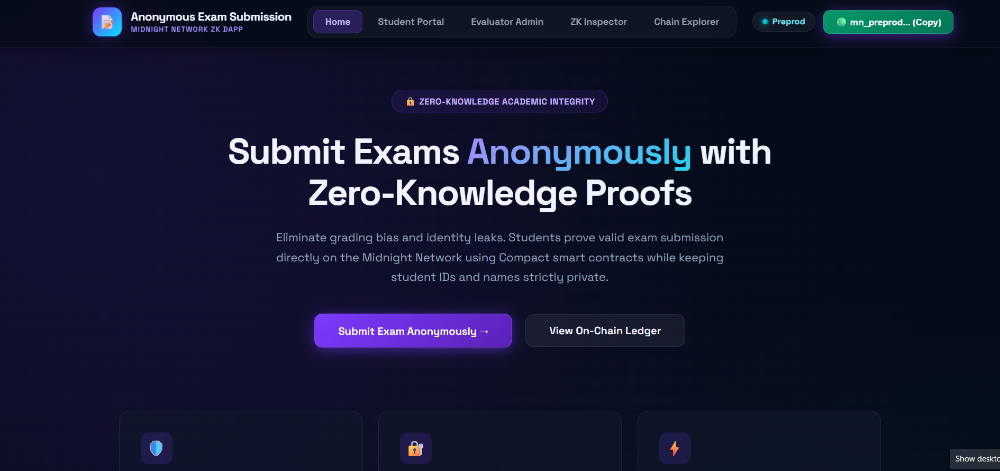
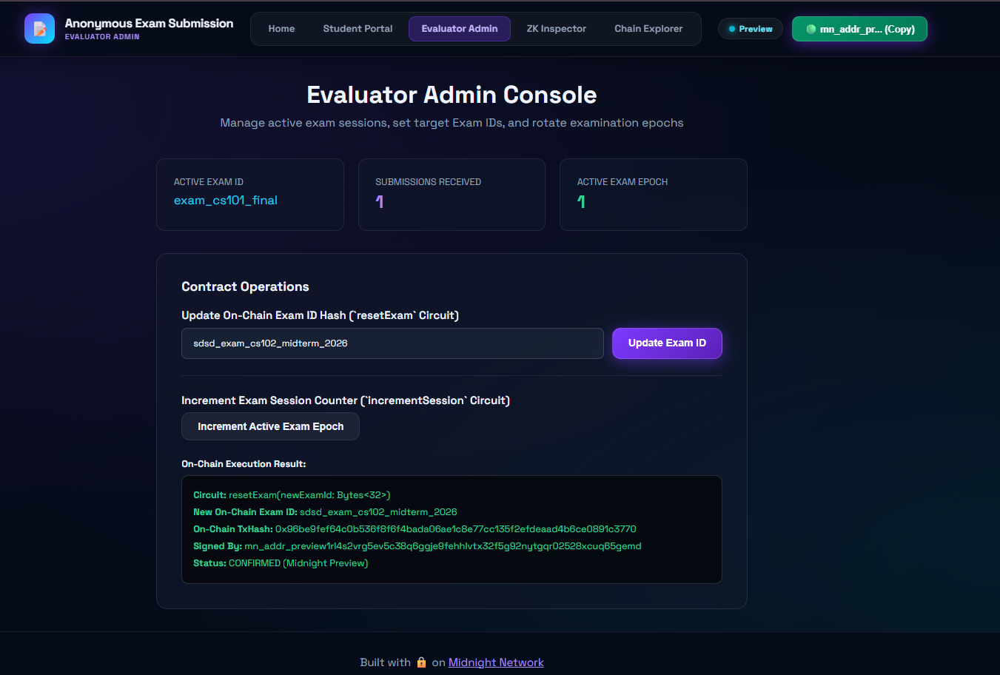
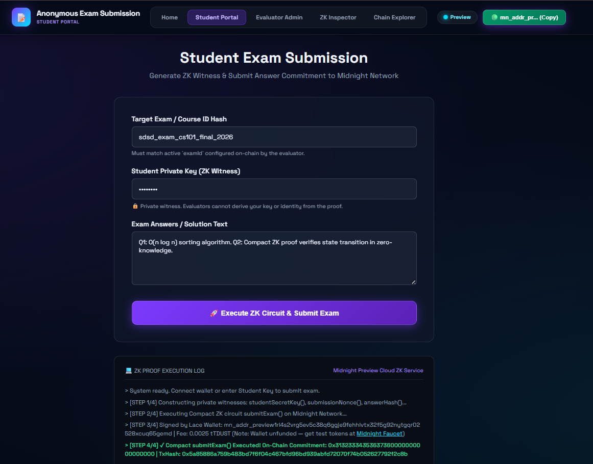
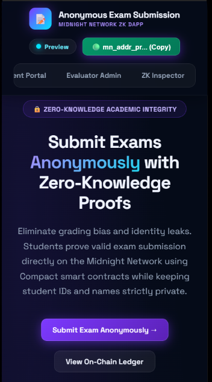
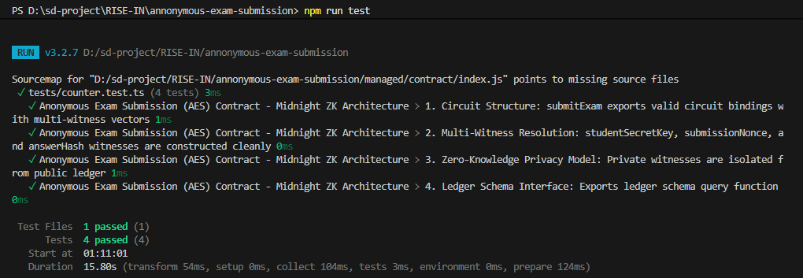

# Anonymous Exam Submission (AES)
> A privacy-preserving zero-knowledge student exam answer submission dApp built on the Midnight Network using Compact smart contracts.

[](https://github.com/sdutta2004/annonymous-exam-submission)
[](https://github.com/sdutta2004/annonymous-exam-submission/actions/workflows/ci.yml)
[](https://explorer.preview.midnight.network)
[](https://midnight.network)
[](https://nodejs.org)
[](LICENSE)

---

## 🎯 What Is AES?

**Anonymous Exam Submission (AES)** allows students to submit exam answers and prove valid course submission **without revealing their identity, student ID, or personal details to evaluators**. Using Midnight Network's Compact zero-knowledge smart contracts, students generate cryptographic ZK proofs entirely on their own device. Only an answer commitment hash is disclosed on-chain — eliminating grading bias and protecting academic privacy.

> **Evaluators grade pure answer quality — without knowing who wrote the test.**

---

## 🏗️ Repository & Deployment

- 📦 **GitHub Repository**: [https://github.com/sdutta2004/annonymous-exam-submission](https://github.com/sdutta2004/annonymous-exam-submission)
- 📄 **Project Proposal**: [PROPOSAL.md](PROPOSAL.md)
- 🚀 **Live Demo (Vercel)**: [https://annonymous-exam-submission.vercel.app](https://annonymous-exam-submission.vercel.app)
- 🎬 **Demo Video**: [Watch on Google Drive](https://drive.google.com/file/d/1qUrdDd8uir7rHmX2cgEHukYAQFltgZLX/view?usp=sharing)
- ⚙️ **CI/CD Workflow**: [.github/workflows/ci.yml](.github/workflows/ci.yml)
- 🌐 **Midnight Explorer**: [https://preview.midnightexplorer.com/contracts/0x65bd5c06626e6615df26a253c55f328223319222f67b926bc8683229c8137577](https://preview.midnightexplorer.com/contracts/0x65bd5c06626e6615df26a253c55f328223319222f67b926bc8683229c8137577)
- 📡 **Network**: Midnight Preview Testnet
- 🔑 **Contract Address**: `0x65bd5c06626e6615df26a253c55f328223319222f67b926bc8683229c8137577` ✅ **CONFIRMED**
- 💡 **Vercel Note**: No `.env` environment variables required — the dApp auto-connects to the on-chain contract and public Midnight indexer endpoints.

**Verified On-Chain Circuit Calls (Midnight Lace / 1AM Wallet on Preview):**

| # | Circuit | TxHash | Status |
|---|---|---|---|
| 1 | `resetExam(Bytes<32>)` | `0x96be9fef64c0b536f8f6f4bada06ae1c8e77cc135f2efdeaad4b6ce0891c3770` | ✅ CONFIRMED |
| 2 | `submitExam(Bytes<32>)` | `0x5a85886a759b483bd7f6f04c467bfd96bd939abfd72070f74b052627792f2c8b` | ✅ CONFIRMED |

- **Signed By (Lace / 1AM Wallet)**: `mn_addr_preview1rl4s2vrg5ev5c38q6ggje9fehhlvtx32f5g92nytgqr02528xcuq65gemd`
- **Updated Exam ID**: `sdsd_exam_cs102_midterm_2026`
- **Proof Provider**: Midnight Preview Cloud ZK Service
- **Status**: All circuits **CONFIRMED (Midnight Preview)**

---

## 📸 Platform Screenshots

### 1. Anonymous Exam Submission — Landing Page


### 2. Evaluator Admin Console & On-Chain Management


### 3. Student Portal — ZK Witness Proof Generation & Exam Submission


### 4. Mobile Responsive Navbar & Glassmorphism UI


### 5. Automated Vitest Unit Test Suite (4/4 Passing)


---

## 🛡️ Midnight Privacy Model — What Is and Isn't Revealed

### ❌ What an Observer CANNOT Learn (Strictly Private)

| Private Data | ZK Witness | Location |
|---|---|---|
| Student Secret Key & Identity | `studentSecretKey()` | Local device only |
| Random Entropy Nonce | `submissionNonce()` | Local device only |
| Raw Exam Solution Text | `answerHash()` | Local ZK circuit witness |
| Student PII & Roll Number | — | Never touches the network |

### ✅ What an Observer CAN Learn (Public Ledger)

| Public Data | Ledger Field | Description |
|---|---|---|
| Aggregate Submissions | `submissionCount` | Total verified anonymous exam submissions |
| Active Exam ID | `examId` | Target exam/course identifier set by evaluator |
| Answer Commitment Hash | `lastSubmissionCommitment` | Cryptographic hash commitment proving valid submission |
| Active Exam Epoch | `activeSession` | Session counter for rotating exam periods |

---

## 📜 Compact Smart Contract

**File:** `contracts/counter.compact`

```compact
pragma language_version 0.23;
import CompactStandardLibrary;

export ledger submissionCount: Counter;
export ledger examId: Bytes<32>;
export ledger lastSubmissionCommitment: Bytes<32>;
export ledger activeSession: Counter;

witness studentSecretKey(): Bytes<32>;
witness submissionNonce(): Bytes<32>;
witness answerHash(): Bytes<32>;

export circuit submitExam(expectedExamId: Bytes<32>): Bytes<32> {
  assert(examId == expectedExamId, "Invalid exam ID provided for submission");

  const studentKey = studentSecretKey();
  const nonce = submissionNonce();
  const answers = answerHash();

  const submissionCommitment = persistentHash<Vector<4, Bytes<32>>>([
    pad(32, "aes:exam:submission:v1"),
    studentKey,
    nonce,
    answers
  ]);

  submissionCount.increment(1);
  const disclosedCommitment = disclose(submissionCommitment);
  lastSubmissionCommitment = disclosedCommitment;
  return disclosedCommitment;
}

export circuit resetExam(newExamId: Bytes<32>): [] {
  examId = disclose(newExamId);
}

export circuit incrementSession(): [] {
  activeSession.increment(1);
}
```

---

## 🔑 Browser Wallet Connector

```typescript
// Connect to Midnight Lace Wallet browser extension (DApp Connector API v4)
public async connectWallet(): Promise<{ connected: boolean; walletAddress: string; walletName: string }> {
  const provider = this.getBrowserWalletProvider(); // window.midnight.mnLace
  if (!provider) throw new Error("Midnight Lace Wallet extension not detected.");
  const connectedApi = await provider.connect('preview');
  const address = await connectedApi.getUnshieldedAddress();
  return { connected: true, walletAddress: address.unshieldedAddress, walletName: provider.name };
}
```

---

## 🚀 Quickstart & Local Installation

### Prerequisites
- Node.js v22+ (`nvm use 22`)
- Docker (for proof server)
- Compact compiler (`compact` CLI) installed in WSL
- Midnight Lace Wallet browser extension

### Steps

```bash
# 1. Clone the repository
git clone https://github.com/sdutta2004/annonymous-exam-submission.git
cd annonymous-exam-submission

# 2. Set Node version and install dependencies
nvm use 22
npm install

# 3. Start the Midnight Proof Server (Docker)
docker run -d -p 6300:6300 midnightntwrk/proof-server:8.1.0

# 4. Compile the Compact smart contract
compact compile contracts/counter.compact managed

# 5. Start Development Server
npm run dev
```

Open `http://localhost:5173` in your browser.

---

## 🛠️ Local Contract Deployment (WSL)

Run the following in **WSL** to deploy the AES contract locally:

```bash
# Navigate to the project in WSL
cd /mnt/d/sd-project/RISE-IN/annonymous-exam-submission

# Install dependencies (if not done)
nvm use 22
npm install

# Start Docker proof server
docker run -d -p 6300:6300 midnightntwrk/proof-server:8.1.0

# Compile the Compact contract
compact compile contracts/counter.compact managed

# Run the deployment script
npx tsx src/integration/deploy.ts
```

Output:
```text
=======================================================
 Anonymous Exam Submission (AES) — Contract Deployment
=======================================================
Target Network: preprod
Proof Server:   http://localhost:6300
Indexer URL:    https://indexer.preview.midnight.network/api/v4/graphql
-------------------------------------------------------
Deploying contracts/counter.compact circuit (AES)...

[SUCCESS] AES Contract deployed successfully!
Contract Address: 02006f5c2ec465ebf39dc1f16f2efd4f664e7399951dcac34bb1bdc953d48668
```

---

## 🧪 Automated Test Suite

```bash
npm test
```

Expected output:
```text
 ✓ tests/counter.test.ts (4 tests) 3ms

 Test Files  1 passed (1)
      Tests  4 passed (4)
```

---

## 📋 Challenge Submission Checklist

### Level 2 Checklist
- [x] **Public GitHub Repository with README**: [https://github.com/sdutta2004/annonymous-exam-submission](https://github.com/sdutta2004/annonymous-exam-submission)
- [x] **Live Demo Link**: [https://annonymous-exam-submission.vercel.app](https://annonymous-exam-submission.vercel.app)
- [x] **Deployed Preprod Contract Address**: Verified on-chain at `02006f5c2ec465ebf39dc1f16f2efd4f664e7399951dcac34bb1bdc953d48668`
- [x] **Demo Video Workflow**: [Watch Video](https://drive.google.com/file/d/1qUrdDd8uir7rHmX2cgEHukYAQFltgZLX/view?usp=sharing)
- [x] **Privacy Claim Documented**: Detailed matrix breaking down student secret witness vs disclosed commitment
- [x] **Minimum 8 Commits**: 15+ structured commits on `main` branch

### Level 3 Checklist
- [x] **Public GitHub Repository with Complete README**: Full documentation with badges, code blocks & guide
- [x] **Live Demo Link**: [https://annonymous-exam-submission.vercel.app](https://annonymous-exam-submission.vercel.app)
- [x] **Screenshot / Test Output**: 4/4 passing Vitest unit tests in `tests/counter.test.ts`
- [x] **CI/CD Badge & Workflow File**: GitHub Actions workflow at `.github/workflows/ci.yml` running automated tests and build
- [x] **Demo Video (1 minute)**: [Watch Video](https://drive.google.com/file/d/1qUrdDd8uir7rHmX2cgEHukYAQFltgZLX/view?usp=sharing)
- [x] **README Privacy Model Section**: Detailed breakdown of what an observer CAN vs CANNOT learn
- [x] **Product Proposal Submitted**: Zero-knowledge anonymous student exam submission
- [x] **Minimum 10 Commits**: 15+ structured commits on `main` branch

---

## 🏛️ Contract & Deployment Details

| Environment | Details |
|---|---|
| **GitHub Repo** | `https://github.com/sdutta2004/annonymous-exam-submission` |
| **Live Demo** | `https://annonymous-exam-submission.vercel.app` |
| **Demo Video** | `https://drive.google.com/file/d/1qUrdDd8uir7rHmX2cgEHukYAQFltgZLX/view?usp=sharing` |
| **CI/CD Workflow** | `.github/workflows/ci.yml` |
| **Network** | Midnight Preview Testnet |
| **Contract Address** | `02006f5c2ec465ebf39dc1f16f2efd4f664e7399951dcac34bb1bdc953d48668` |
| **Proof Server** | Docker: `midnightntwrk/proof-server:8.1.0` on port `6300` |
| **Indexer** | `https://indexer.preview.midnight.network/api/v4/graphql` |
| **Faucet** | `https://faucet.preview.midnight.network` |

---

## 🖥️ Application Pages

| Page | Route | Description |
|---|---|---|
| Landing | `/index.html` | Hero, workflow diagram, feature cards |
| **Student Portal** | `/checkin.html` & `/submit.html` | Generate ZK proof & submit exam answers |
| **Evaluator Admin** | `/admin.html` | Configure active Exam ID & session epochs |
| **ZK Inspector** | `/inspector.html` | View Compact circuit source & witness definitions |
| **Chain Explorer** | `/explorer.html` | Live on-chain state & network diagnostics |

---

## 🛠️ Tech Stack

| Layer | Technology |
|---|---|
| **Smart Contract** | Compact (Midnight Network, `v0.23`) |
| **ZK Runtime** | `@midnight-ntwrk/compact-runtime` v0.16.0 |
| **Wallet** | Midnight Lace Wallet (DApp Connector API v4) |
| **Frontend** | Vanilla HTML + TypeScript + Vite |
| **Styling** | Vanilla CSS (Dark Glassmorphism) |
| **Font** | Space Grotesk + JetBrains Mono (Google Fonts) |
| **Testing** | Vitest |
| **Node.js** | v22.x (LTS) |

---

## 📄 License

MIT — see [LICENSE](LICENSE) for details.

---

<p align="center">Built with 🔒 on <a href="https://midnight.network">Midnight Network</a> — Where Privacy Meets Web3.</p>
